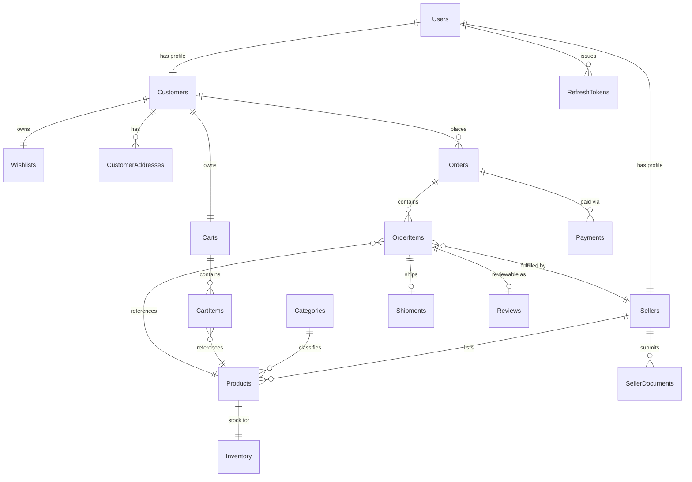
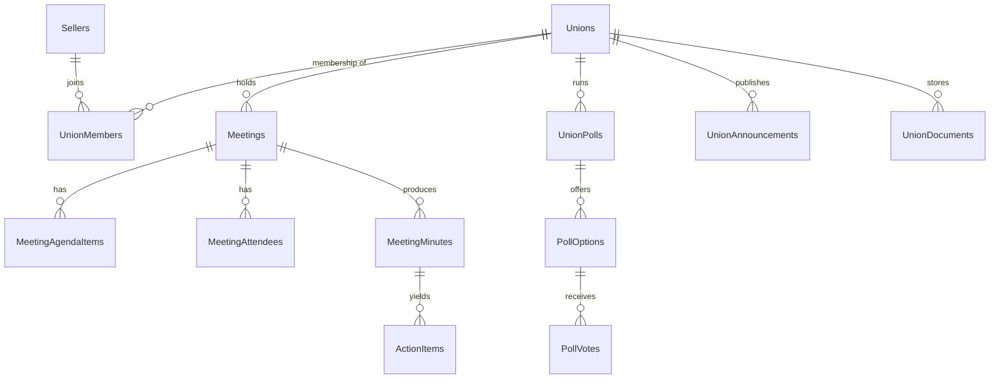

# Database

Generated from `src/JewelryHub.Persistence/Migrations/20260804130625_InitialCreate.cs` and
`JewelryHubDbContext.cs` — this is the schema as of that migration. **Regenerate this file
whenever a new migration is added.**

## Conventions

- **Provider**: SQL Server (`Microsoft.EntityFrameworkCore.SqlServer`).
- **Primary keys**: every table has a client-generated `Guid Id` (via `BaseEntity`) — no
  database-generated identity columns.
- **Decimal precision**: unconfigured `decimal` columns default to `decimal(18,4)`
  (`OnModelCreating` in `JewelryHubDbContext.cs`).
- **Concurrency**: `Users.RowVersion` is a SQL Server `rowversion` column
  (`IsRowVersion()`), used for optimistic concurrency on that entity.
- **Auditing**: entities inheriting `AuditableEntity` get `CreatedAtUtc`, `CreatedBy`,
  `ModifiedAtUtc`, `ModifiedBy`, stamped automatically by
  `AuditableEntitySaveChangesInterceptor` — never set these by hand.
- **Soft delete**: entities implementing `ISoftDelete` get an `IsDeleted` column and a global
  `HasQueryFilter(x => !x.IsDeleted)` — deleted rows never appear in a normal query without an
  explicit `IgnoreQueryFilters()`. A hard `Remove()` is converted into a soft-delete update by the
  interceptor.
- **Indexes**: EF Core auto-creates an index on every FK column; unique indexes are added
  explicitly where uniqueness matters (e.g. `Users.Email`).
- Totals for this migration: **41 tables**, **61 foreign keys**, **78 indexes**.

## Tables by Bounded Context

### Identity (6 tables)
| Table | Notable columns / relationships |
|---|---|
| `Users` | `Email` (unique index), `PasswordHash`, `SecurityStamp`, `RowVersion` (concurrency token), soft-delete filtered |
| `Roles` | Admin / Seller / Customer, seeded by `DbSeeder` on startup |
| `Permissions` | Permission catalog |
| `RolePermissions` | Join: `RoleId` → `Roles`, `PermissionId` → `Permissions` |
| `UserRoles` | Join: `UserId` → `Users`, `RoleId` → `Roles` |
| `RefreshTokens` | `UserId` → `Users`; stores `TokenHash` (never the raw token), `RevokedAtUtc`, `ReplacedByTokenHash` for rotation/reuse-detection |

### Customers (2 tables)
| Table | Relationships |
|---|---|
| `Customers` | `UserId` → `Users` (1:1) |
| `CustomerAddresses` | `CustomerId` → `Customers` |

### Sellers (2 tables)
| Table | Relationships |
|---|---|
| `Sellers` | `UserId` → `Users` (1:1); carries `VerificationStatus` (KYC state machine) |
| `SellerDocuments` | `SellerId` → `Sellers`; KYC document submissions, each individually reviewable |

### Catalog (6 tables)
| Table | Relationships |
|---|---|
| `Categories` | Self-referencing `ParentCategoryId` → `Categories` (tree) |
| `Products` | `CategoryId` → `Categories`, `SellerId` → `Sellers` |
| `Inventory` | `ProductId` → `Products` (1:1 stock record) |
| `ProductCertificates` | `ProductId` → `Products` (gemstone/purity certification) |
| `ProductGemstones` | `ProductId` → `Products` |
| `ProductImages` | `ProductId` → `Products` |

### Cart (2 tables)
| Table | Relationships |
|---|---|
| `Carts` | `CustomerId` → `Customers` (1:1) |
| `CartItems` | `CartId` → `Carts`, `ProductId` → `Products` |

### Wishlist (2 tables)
| Table | Relationships |
|---|---|
| `Wishlists` | `CustomerId` → `Customers` (1:1) |
| `WishlistItems` | `WishlistId` → `Wishlists`, `ProductId` → `Products` |

### Orders / Payments / Tax (7 tables)
| Table | Relationships |
|---|---|
| `Orders` | `CustomerId` → `Customers`, `BillingAddressId` → `CustomerAddresses`, `ShippingAddressId` → `CustomerAddresses` |
| `OrderItems` | `OrderId` → `Orders`, `ProductId` → `Products`, `SellerId` → `Sellers` — per-item status lets each seller fulfill independently on a multi-seller order |
| `OrderTaxes` | `OrderItemId` → `OrderItems`, `TaxRateId` → `TaxRates` |
| `Shipments` | `OrderItemId` → `OrderItems` |
| `Payments` | `OrderId` → `Orders` |
| `TaxRates` | `CategoryId` → `Categories` (rate can vary by category — no dedicated CRUD API yet, see [API_PROGRESS.md](API_PROGRESS.md)) |

### Reviews (1 table)
| Table | Relationships |
|---|---|
| `Reviews` | `CustomerId` → `Customers`, `ProductId` → `Products`, `SellerId` → `Sellers`, `OrderItemId` → `OrderItems` (a review is tied to a specific fulfilled purchase) |

### Notifications (1 table)
| Table | Relationships |
|---|---|
| `Notifications` | `RecipientUserId` → `Users`; persisted first, then pushed live over SignalR ("persist-then-push") |

### Jewelry Union (13 tables — Domain/Persistence only, no Application/API coverage yet)
| Table | Relationships |
|---|---|
| `Unions` | `CreatedBySellerId` → `Sellers` |
| `UnionMembers` | `SellerId` → `Sellers`, `UnionId` → `Unions` — membership roster |
| `UnionEvents` | `UnionId` → `Unions` |
| `UnionAnnouncements` | `UnionId` → `Unions`, `PublishedByMemberId` → `UnionMembers` |
| `UnionDocuments` | `UnionId` → `Unions`, `UploadedByMemberId` → `UnionMembers` |
| `UnionPolls` | `UnionId` → `Unions`, `CreatedByMemberId` → `UnionMembers` |
| `PollOptions` | `PollId` → `UnionPolls` |
| `PollVotes` | `PollOptionId` → `PollOptions`, `UnionMemberId` → `UnionMembers` |
| `Meetings` | `UnionId` → `Unions`, `CreatedByMemberId` → `UnionMembers` |
| `MeetingAgendaItems` | `MeetingId` → `Meetings` |
| `MeetingAttendees` | `MeetingId` → `Meetings`, `UnionMemberId` → `UnionMembers` |
| `MeetingMinutes` | `MeetingId` → `Meetings`, `AgendaItemId` → `MeetingAgendaItems`, `RecordedByMemberId` → `UnionMembers` |
| `ActionItems` | `MeetingMinuteId` → `MeetingMinutes`, `ResponsibleMemberId` → `UnionMembers` |

The Union schema is considerably more developed than "just an entity" — it's a full governance
data model (meetings, agendas, minutes, action items, polls with options and votes,
announcements, documents). This is the strongest signal in the codebase that Union is intended as
a major feature, not an afterthought — see [ROADMAP.md](ROADMAP.md).

## Entity Relationship Overview (core commerce)

## Entity Relationship Overview (Jewelry Union — modeled, not yet exposed)

## Migration History

| Migration | Notes |
|---|---|
| `20260804130625_InitialCreate` | First migration — full schema for every entity that existed in Domain at the time. Generated 2026-08-04 as part of the onboarding/documentation pass; no migrations existed in the repo before this. |
